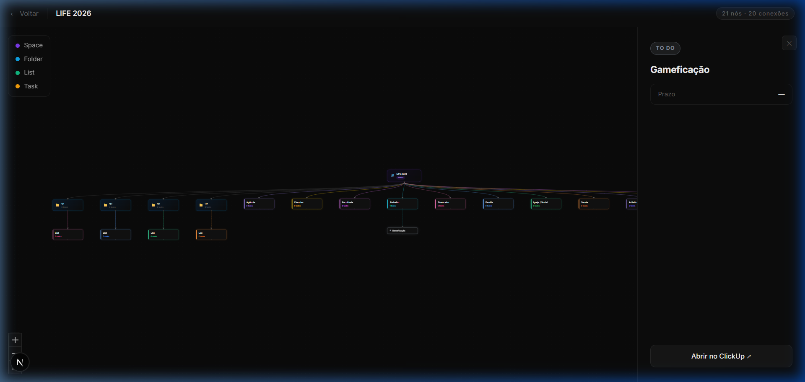
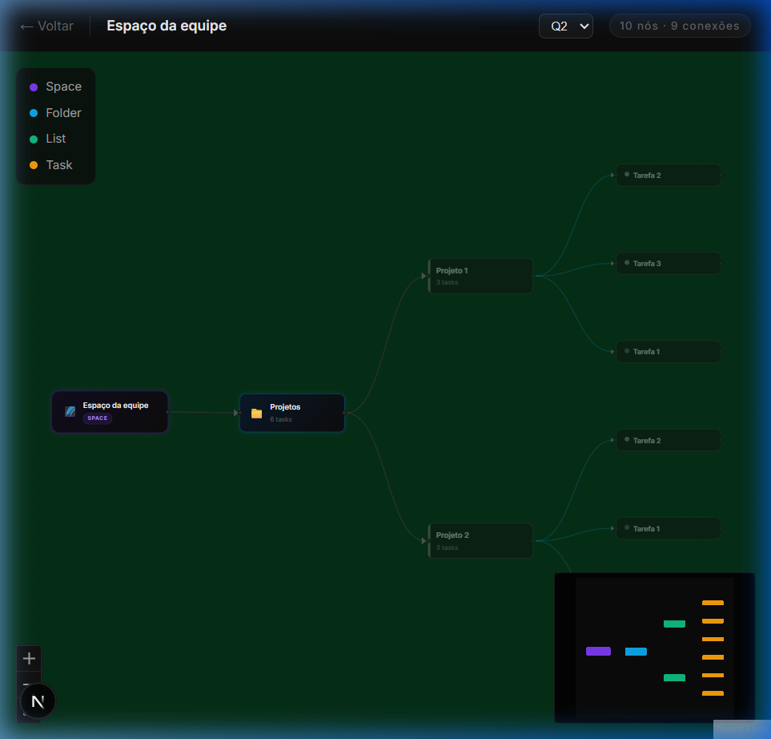

# 🚀 ClickUp Mind Map & Gamification

Uma interface visual dinâmica e poderosa para gerenciar seu workspace do ClickUp em tempo real. Transforme pastas, listas e tarefas em um mapa mental interativo com foco em gestão trimestral e alta performance.



## ✨ Funcionalidades Principais

- **Visualização Hierárquica**: Navegue por Espaços, Pastas, Listas e Tarefas em uma estrutura de rede fluida.
- **Gestão Sazonal (Estações do Ano)**: Filtragem temporal inteligente baseada em Custom Fields nativos do ClickUp.
- **Edição Inline & UI Otimista**: Renomeie tarefas e mude status com feedback visual instantâneo (zero delay de rede).
- **Status Engine**: Sincronização bidirecional de status com suporte a cores customizadas e pílulas interativas.
- **Criação Rápida**: Adicione listas e tarefas diretamente pelo gráfico usando atalhos intuitivos (`TAB` para criar, `ENTER` para salvar).
- **Responsável Automático**: Atribuição nativa de responsáveis no momento da criação da tarefa.
- **Layout Inteligente**: Alternância entre modos Manual (persistente) e Automático (Tree Layout).

## 📸 Screenshots


_Mapa Mental dinâmico com fluxos do ClickUp_


_Painel de Detalhes com seletor de status e cores dinâmicas_

## 🛠️ Tecnologias

- **Framework**: [Next.js 15](https://nextjs.org/) (App Router)
- **Gráficos**: [React Flow](https://reactflow.dev/) (SvelteFlow Engine)
- **Estado**: [Zustand](https://github.com/pmndrs/zustand) + [TanStack Query](https://tanstack.com/query/latest) (Cache & Optimistic UI)
- **API**: ClickUp API v2 Integration
- **Estilo**: CSS Moderno (Glassmorphism & High-Contrast Themes)

## 🚀 Como Começar

### Pré-requisitos

- Node.js 18+
- ClickUp API Token

### Instalação

1. Clone o repositório:

```bash
git clone https://github.com/19089910/gamification_clickup.git
```

2. Instale as dependências:

```bash
npm install
```

3. Configure o `.env.local`:

```env
CLICKUP_API_TOKEN=your_token_here
CLICKUP_TEAM_ID=your_token_here

NEXT_PUBLIC_TRIMESTRE_FIELD_ID=your_id_here

NEXT_PUBLIC_SUMMER_ID=your_id_here
NEXT_PUBLIC_FALL_ID=your_id_here
NEXT_PUBLIC_WINTER_ID=your_id_here
NEXT_PUBLIC_SPRING_ID=your_id_here
```
### 📌 Descrição

- **CLICKUP_API_TOKEN**: Token de autenticação da API do ClickUp  
- **NEXT_PUBLIC_TRIMESTRE_FIELD_ID**: ID do campo personalizado de trimestre no ClickUp  
- **NEXT_PUBLIC_SUMMER_ID / NEXT_PUBLIC_FALL_ID / NEXT_PUBLIC_WINTER_ID / NEXT_PUBLIC_SPRING_ID**: IDs correspondentes a cada trimestre no ClickUp  

4. Inicie o servidor de desenvolvimento:

```bash
npm run dev
```

---

_Desenvolvido para transformar produtividade em uma experiência visual irresistível._
